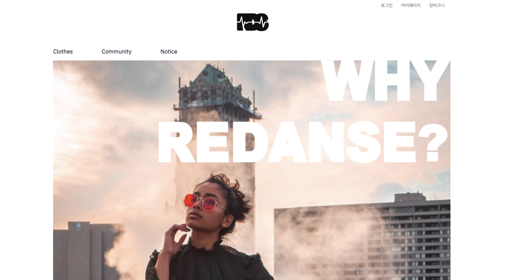

# 리단세

## 1. 프로젝트 개요
- 프로젝트명: Re-danse
- DevOps 프로젝트 기반 클라우드교육(PYTHON 개발자 양성과정) 프로젝트
- 기간: 2022.01.24 ~ 2022.03.04
- 참여 인원: 3명
- 프로젝트 목표: 댄서 의상 대여 온라인 플랫폼 구축 
- 맡은 역할
``` text
- 프론트엔드 총괄 및 디자인 전담
- 메인 페이지 디자인
- 서버 연결
- 제품 관리 게시판
- 1:1 문의 게시판
- 마이페이지
```

### 1.1. 개발 환경
- OS: Windows 10 
- Version Control: Github
- Framework: Django
- WireFrame: Kakao Oven
- Front-End: React / Javascript / tailwind css
- Back-End: Python
- Server: AWS lightsail 
- DB: Maria DB
- Developer Tools: Pycharm / vscode


### 1.2. 세부 일정
|일정|항목|비고|
|:---:|:---:|:---:|
|01.24 - 01.27|요구사항 분석|
|01.26 - 01.26|기능 리스트 작성|
|01.27 - 01.28|스토리보드 작성
|02.03 - 02.03|ERD, DDL 작성
|02.04 - 02.04|환경 설정
|02.08 - 02.24|백엔드 개발
|02.25 - 03.02|프론트엔드 개발
|03.03 - 03.03|서버 연결, 통합 테스트
|03.04|발표|

## 2. 기능

### 2.1. 사용자
- 로그인 및 회원가입
- 의상 대여
- 카테고리별 의상 조회
- 장바구니
- 결제
- 커뮤니티
  - 등록/수정/삭제
  - 검색 및 페이징 기능
- 공지사항
  - 검색 및 페이징 기능
- 마이페이지
  - 대여 의상 및 후기 
  - 내 정보 수정
  - 1:1 문의 조회/등록/삭제
  - 회원 탈퇴

### 2.2. 관리자
- 관리자로 로그인 시 관리자 페이지로 이동
- 회원 관리: 회원 정보 수정/삭제
- 의상 관리: 의상 조회/삭제
- 후기 관리: 후기 조회/삭제
- 공지사항: 조회/등록/수정/삭제
- 1:1 문의 조회/답변등록/삭제
  - 답변 여부 

### 3. 맡은 기능
- 메인페이지 디자인

- 프론트엔드 총괄 및 디자인 전담
- 메인 페이지 디자인
- 서버 연결
- 제품 관리 게시판
- 1:1 문의 게시판
- 마이페이지

### 4. 프로젝트 후기
- 처음 하는 프로젝트여서 설레고 애정도 많았다. 실제로 프로젝트를 하면서 개발을 하고 눈으로 보이도록 실체화하는 게 즐겁다고 느꼈다. 
- 그 전에 배웠던 디자인을 여기서 쓰게 되었다. 역시 사람은 많이 도전하고 봐야한다. 
- 새로 배우는 내용들이 많았고 오히려 그 점이 더 매력적이었다. 오래오래 개발자를 하고 싶다.


- 📿 [팀 깃허브 백엔드(Django)](https://github.com/BACKHAERANI/project-pajama-django)
- 📿 [팀 깃허브 프론트엔드(React)](https://github.com/BACKHAERANI/project-pajama-react)
